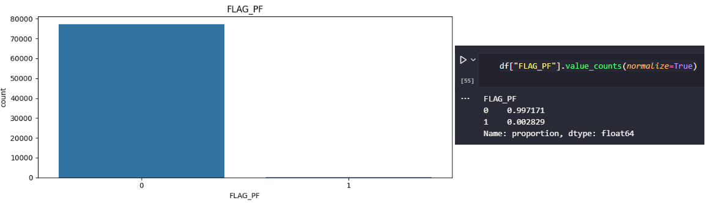
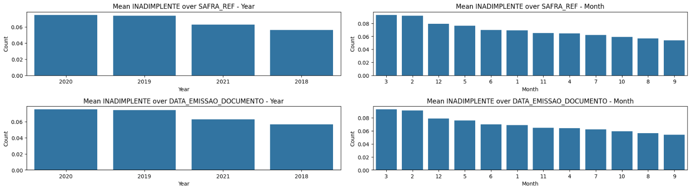

# [Customer Default Prediction on Loans](https://clientdefaultpred.azurewebsites.net/)


## Dataset
This project is composed by four datasets.

### Base Cadastral
- ID_CLIENTE: The client ID
- DATA_CADASTRO: The date the client registered
- DDD: The area code of the client's phone number
- FLAG_PF: Indicates if the client is an individual ('PF') or not
- SEGMENTO_INDUSTRIAL: The industrial segment of the client
- DOMINIO_EMAIL: The email domain of the client
- PORTE: The size of the company (e.g., small, medium, large)
- CEP_2_DIG: The first two digits of the client's postal code

### Base Info
- ID_CLIENTE: The client ID
- SAFRA_REF: The reference season for the data
- RENDA_MES_ANTERIOR: The income of the previous month
- NO_FUNCIONARIOS: The number of employees in the company on the previous month

### Base Pagamentos (training and testing)
- ID_CLIENTE: The client ID
- SAFRA_REF: The reference season for the data
- DATA_EMISSAO_DOCUMENTO: The loan issue date
- DATA_VENCIMENTO: The due date to pay the loan
- VALOR_A_PAGAR: The amount to be paid
- TAXA: The interest rate of the loan
- DATA_PAGAMENTO: The date the client paid the loan (only available on the training dataset)

### Target
There's no column for a target variable, so it has to be manually made. The target needs to have the name **INADIMPLENCIA**, and it will be 1 for customers who have a delay, that is, a difference between payment and due date, greater or equal to 5 days, and 0 for all others.
- INADIMPLENCIA: Defaulted the loan payment or not

## Objectives
The main objective of this project is:

**To develop a predictive model capable of generating predictions regarding the samples present in the base_pagamentos_teste.csv database. A new dataset containing the columns: ID_CLIENTE, SAFRA_REF and INADIMPLENTE must be created, with INADIMPLENTE being the probability of the customer defaulting the payment**

To achieve this objective, it was further broken down into the following technical sub-objectives:

1. To clean and join the datasets
2. To perform in-depth exploratory data analysis of the resulting dataset
3. To engineer new predictive features from the available features
4. To develop a supervised model to predict the chances of a customer default a payment
5. To put the model into production with a web app

## Data Cleaning
From the data cleaning, it was possible to see that only **Base Cadastro** had NaN values, with the column `FLAG_PF` having almost all values as NaN. To fix this, an analysis was conducted in the dataset and this is how all the missing values were handled:
- For `FLAG_PF`, since it's only an indicator of yes and no, all NaN values were replaced by **0** and all **x** values by **1**
- The missing values for `SEGMENTO_INDUSTRIAL`, `DOMINIO_EMAIL` and `PORTE` were replaced by a new category called **Unknown**
- `DDD` and `CEP_2_DIG` were mapped to their respective states, and then mapped to country regions. If a value of either column did not exist in the maps, it was replaced by **Unknwown**. These custom maps for each column were saved as a **.pkl** file

After the missing data was handled, the datasets were joined to create the training dataset and test dataset. For this, the **left join** was used, to avoid missing any data from **Base Pagamentos**. Firstly, **Base Pagamentos** was joined with the new clean version of **Base Cadastro**, on the `ID_CLIENTE` column. Then, the resulting dataset was joined with **Base Info** on the columns `ID_CLIENTE` and `SAFRA_REF`. The missing values of the columns `RENDA_MES_ANTERIOR` and `NO_FUNCIONARIOS` were filled with the median of each column per client ID, to avoid outliers and avoid that a client with a low value in each of these columns gets a new value that it's not similar to his real data. With both training and testing datasets done, the target `INADIMPLENTE` was created in the training dataset, and they were saved as .csv files.

To see the complete analysis that led to these actions, with the explanations on why each step was taken, please check the [Data Cleaning Notebook](https://github.com/vitorccmanso/Customer-Default-Prediction/blob/main/Notebooks/Data%20Cleaning.ipynb).

## Main Insights
From the exploratory data analysis, these were the main points that stood out:
- `INADIMPLENTE` is extremely unbalanced, with almost 93% of all data on the **No** class, determined by the 0


- `VALOR_A_PAGAR` has a heavily positively skewed distribution, with mode < median < mean


- `FLAG_PF` is extremely unbalanced, with 99.7% of all data in the **0** category



- `DDD` and `CEP_2_DIG` show a similar behavior, with the majority of clients from **Sudeste**, that has more than double the amount of clients from any other region


- For `SAFRA_REF` and `DATA_EMISSAO_DOCUMENTO`, **Year** and **Month** have basically the same pattern, with **2020** and **2019** being the ones with the highest mean of defaulting clients, and **February** and **March** being the months with the highest mean of defaulting clients. After these values, there's a steady decline for each other value



- `DATA_VENCIMENTO` shows that if the month of the due day for payment is **March**, the mean for the client defaulting is more than 10%


- `DATA_CADASTRO` shows **August** with a mean of defaulting of almost 15%, and **2021** has a mean of almost 30%


To see the complete EDA, please check the [Exploratory Data Analysis Notebook](https://github.com/vitorccmanso/Customer-Default-Prediction/blob/main/Notebooks/EDA.ipynb).

## Engineered Features
From the knowledge gained during the EDA, the following features were created:
- `year`: The year of `SAFRA_REF`
- `month`: The month of `SAFRA_REF`
- `month-vencimento`: The month of `DATA_VENCIMENTO`
- `year_cadastro`: The year of `DATA_CADASTRO`
- `month_cadastro`: The month of `DATA_CADASTRO`
- `loan_age`: Calculates how long it has been since the loan was issued
- `days_until_due`: Computes the number of days remaining until the loan is due
- `days_since_registration`: Calculates the difference from client registration to loan issuance date

With these new features, an analysis was made to see which ones would actually have an impact on the model training phase. For that, it was used a statistical approach and a practical approach. The statistical one was using **ANOVA** to check the **p-value** of each new feature, to see if they were significant in relation to the target. The column `year` was the only one with a **p-value** of over 0.05, deeming the feature not significant. For the practical approach, a boxplot was plotted for each new feature in relation to the target. These were the conclusions:
- The columns `year`, `month`, `year_cadastro` and `month_cadastro` can be dropped, since they have no practical relevance, despite three of them being significant in the **ANOVA** test
- `month_vencimento`, `loan_age` and `days_since_registration` can be used in a correlation heatmap to check for any kind of collinearity between features
- `days_until_due` shows a clear difference between the classes of the target variable

After further analysis, `loan_age` was also dropped because it showed a strong correlation with `days_until_due`, but had a smaller correlation with the target. So, out of the columns created, the ones used were: `month_vencimento`, `days_until_due` and `days_since_registration`. To finish this step, the numeric columns were analyzed to see if any transformation (log or cubic) would help to transform their distributions into more closely resembling a normal one, since scaling techniques and certain models tend to perform better with normally distributed data.

To see the complete Feature Engineering step, please check the [Feature Engineering Notebook](https://github.com/vitorccmanso/Customer-Default-Prediction/blob/main/Notebooks/Feature%20Engineering.ipynb).

## Models
For the modeling phase, three models will be used: Logistic Regression, Random Forest and Gradient Boosting. During each training and testing, two methods will be used to solve the imbalance issue of the target. The first one is using the parameter `class_weight` on the models that have it. The second method is the utilization of `SMOTE`, an oversampling method that uses synthetic data to balance the target. `SMOTE` will only be applied to the training sets, with the test sets having the original imbalance of the data.

After the training, the models were evaluated in terms of the metrics `Recall`, `Precision`, `f1` and `ROC-AUC`. `f1` and `Recall` are the most important metrics here, since the primary goal is to predict loan defaults. `Recall` is the proportion of true positives out of the actual positives, with a high recall consisting of a low number of false negatives. `Precision` is the proportion of positive predictions that are actually correct, with fewer false positives indicating a higher precision. `f1` is the the harmonic average between them, and ROC-AUC is used to evaluate the model's ability to discriminate the data between the two classes.

In this project, a high `Recall` is important, since a low number of false negatives indicates a low chance of losing a lot of money with defaulting clients. But this is useless if the precision is extremely low. Because of this, both `Recall` and `f1` were used as the focus of the model training, each metric being the focus of a separate training. With this, a threshold analysis was made to check whether changing the models threshold could improve its results. To train the models, a repo in DagsHub was used, along with MLflow to keep track of all the information about them.

To see the complete Model Training step, please check the [Model Training Notebook](https://github.com/vitorccmanso/Customer-Default-Prediction/blob/main/Notebooks/Model%20Training.ipynb).

### Model performance and Selection
After all four trainings were complete (focus on recall or f1, and smote applied or not), three models were the clear best performers, with a low number of errors (false positives + false negatives) and good values for `Recall` and `Precision`. They were the **Gradient Boosting** trained with a focus on `Recall` and without `SMOTE`, and the **Random Forest** and **Gradient Boosting** both trained with a focus on `Recall` and with `SMOTE` applied.


The first one, in a first glance, seems like a bad model, but a threshold analysis shows that by changing the model's threshold to around 0.1, there would be a massive increase in `Recall` and minimal loss in `Precision`. With that, the confusion matrices of all three models were plotted, with the threshold of this **Gradient Boosting** model changed to 0.1.


As the image shows, the gradient boosting model with a threshold of 0.1 is the best one, but not by much. Assuming that it's more costly for the company emitting these loans to lend money to a defaulting client instead of not lending money to a non-defaulting one, the lower the false negatives, the better the model. Also, since the main objective of this project is to create a new dataset with the columns `ID_CLIENTE`, `SAFRA_REF` and `INADIMPLENTE`, with the last one being the percentage of chance that the client will default, a model with a 0.5 threshold needs to be used. With this, only the **Random Forest** and **Gradient Boosting** trained with a focus on `Recall` and `SMOTE` applied were able to be chosen to put into production.


When plotting the **ROC Curves** of these models, it's basically a tie between them, with a slight advantage for the **Random Forest** model. This means that the **Random Forest** is good at discriminating data between both classes.

So, based on all this information, the best model to be put into production is the **Random Forest** one, trained using `SMOTE` and focusing on `Recall`, being the best performing model with a threshold of 0.5, required by the main goal of this project. The model parameters are:

```json
{
    criterion: "log_loss",
    max_depth: 30,
    max_features: "sqrt",
    n_estimators: 100,
    random_state: 42
}
```

### Model Explainability


When plotting the feature importance for the best model, it's possible to see that `VALOR_A_PAGAR` is the most important one, with a decay in `Recall` above 0.25 when its values are randomly permuted. Also, all features created during feature engineering and used in the model training were in the top 5 most important ones, with `days_since_registration` being a close second.

## App Usage

The easiest way to use the app is by accessing this link: <https://clientdefaultpred.azurewebsites.net/>

However, since the deployment was made with the free plan from Azure, which only gives 60min of usage per day, the other way is through a Docker image or running with uvicorn. Here is a step by step guide on how to create and run this image and how to run the app locally through uvicorn:

### Docker Image
### Step 1: Build Docker Image

The easiest way to build and run a docker image is with Docker Desktop. It can be downloaded [here](https://www.docker.com/products/docker-desktop/).
Clone this repository and go to the folder with the Dockerfile. Then, run the following command to build the image:

```shell
docker build -t client_default_pred:latest .
```

To check if the image was created successfully, run `docker images` in your CLI and you should see `client_difault_pred` listed.

### Step 2: Run Docker Image

In the same CLI, run the following command to run the image:

```shell
docker run -p 80:80 client_default_pred:latest
```

You should see something like this:

```shell
INFO:     Started server process [1]
INFO:     Waiting for application startup.
INFO:     Application startup complete.
INFO:     Uvicorn running on http://0.0.0.0:80 (Press CTRL+C to quit)
```

Open a web browser page and type `localhost` in the search bar. The app should load and be ready for use. Use the dataset **clean_test_final.csv** in the folder `Data` (inside the `Notebooks` folder) to test the `Predict with Dataset` function.

## Running locally trough uvicorn (this assumes that you have python installed)
### Step 1: Install libraries

Clone or download this repository, then go to the main folder of the project (where requirements.txt is). Open a command prompt in this folder and run this command:

```shell
pip install -r requirements.txt
```

### Step 2: Run the app

On the same command prompt, run the following command to run the app:

```shell
uvicorn app.main:app --reload
```

You should see something like this:

```shell
INFO:     Uvicorn running on http://127.0.0.1:8000 (Press CTRL+C to quit)
INFO:     Started reloader process [18496] using WatchFiles
INFO:     Started server process [1344]
INFO:     Waiting for application startup.
INFO:     Application startup complete.
```

Copy the adress that the app is running, in this case `http://127.0.0.1:8000` and open it on a web browser, or simply type in the browser `localhost:8000`. The app should load and be ready for use. Use the dataset **clean_test_final.csv** in the folder `Data` (inside the `Notebooks` folder) to test the `Predict with Dataset` function.
